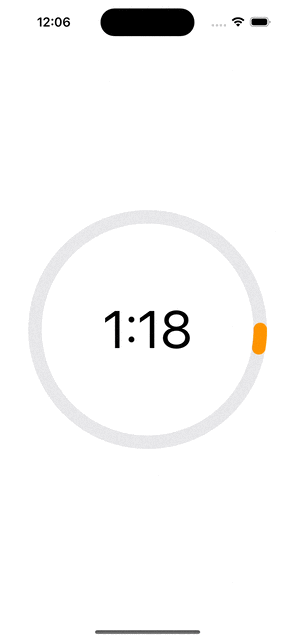

# CircularProgressTimer

A circular progress countdown view.

Preview:



Usage:

```Swift
import SwiftUI
import CircularProgressTimer

struct ContentView: View {
  @State var isCompleted: Bool = false
  private var cptController: CircularProgressTimerController
  
  init() {
    let timer = Timer.publish(every: 1, on: .main, in: .common)
    let counter = 0
    let countTo = 10
    let controller =
    CircularProgressTimerController(timer: timer,
                                    counter: counter,
                                    countTo: countTo)
    self.cptController = controller
  }
  
  var body: some View {
    CircularProgressTimer(isCompleted: $isCompleted)
      .clockSize(CGSizeMake(300, 300))
      .borderWidth(18)
      .fontColor(.black)
      .trackColor(.gray.opacity(0.2))
      .barColor(.orange)
      .completionColor(.green)
      .clockFont(.system(size: 70))
      .environmentObject(cptController)
      .onAppear{
        cptController.resume()
      }
      .onDisappear{
        cptController.cancel()
      }
      .onTapGesture {
        cptController.paused ? cptController.resume() : cptController.pause()
      }
      .valueChanged(value: isCompleted) { newValue in
        if newValue {
          print("Countdown completed")
          cptController.reset()
          isCompleted = false
        }
      }
  }
}
```
